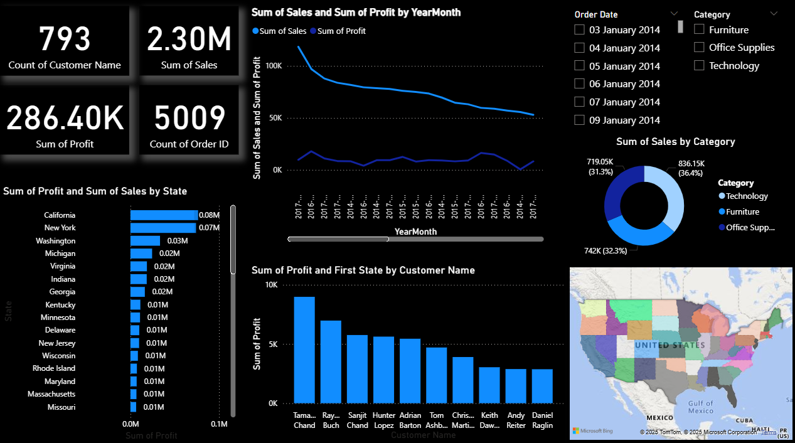

# 🛒 Retail Sales & Profit Analysis Dashboard (Power BI + SQL)

This project analyzes a retail dataset (Superstore) to uncover **sales and profit trends**, **state-wise losses**, and **top-performing customers** using SQL and Power BI. It simulates a real-world data pipeline with an end-to-end analytics approach.

---

## 📁 Project Structure

| Component | Description |
|----------|-------------|
| `Sample - Superstore.csv` | Raw data (Orders, Sales, Profit, Region, etc.) |
| `superstore_dashboard.pbix` | Power BI report file (includes data + visuals) |
| `superstore.sqbpro` | SQLite database project |
| `analysis_queries.sql` | SQL queries used for aggregation and preprocessing |
| `dashboard_overview.png` | Screenshot of final dashboard |

---

## 📊 Key Features & Insights

### 🔥 Year-wise Profit Trend
- 📈 Profit increased consistently from **2014 → 2017**
- Peak profits in **Q4 2017**

### 🗺️ State-Level Analysis
- ❌ **Top Loss-Making States**:
  - Texas: ₹-25,729
  - Ohio: ₹-16,971
  - Pennsylvania: ₹-15,559
- ✅ **Top Profit States**:
  - California: ₹76,381
  - New York: ₹74,038
  - Washington: ₹33,402

### 👥 Customer Segmentation
- Identified **Top 10 Customers** by total sales
- Insights can guide loyalty or upsell campaigns

### 🎛️ Interactive Filters
- Slicers for **Year** and **Category** help dynamic filtering
- Charts and KPIs update in real-time based on user input

### 📌 KPI Summary Cards
- 📦 Total Orders
- 💸 Total Sales
- 💰 Total Profit
- 👥 Total Unique Customers

---

## 📷 Dashboard Preview

---

## 🛠️ Tools & Technologies

- **SQL (SQLite Studio)** – Data cleaning and aggregation
- **Power BI Desktop** – Visual analytics and dashboarding
- **DAX** – Custom calculated columns (e.g., Year extraction)
- **Data Modeling** – Relationships between tables, slicers
- **Excel/CSV** – Raw data input

---

## 📂 How to Use

1. Clone or download this repository
2. Open `superstore_dashboard.pbix` in Power BI Desktop
3. Apply filters or explore different charts
4. Open `analysis_queries.sql` in any SQL editor (SQLite recommended)

---

## 👨‍💻 Author

**Yash Kumar Jha**  

---

